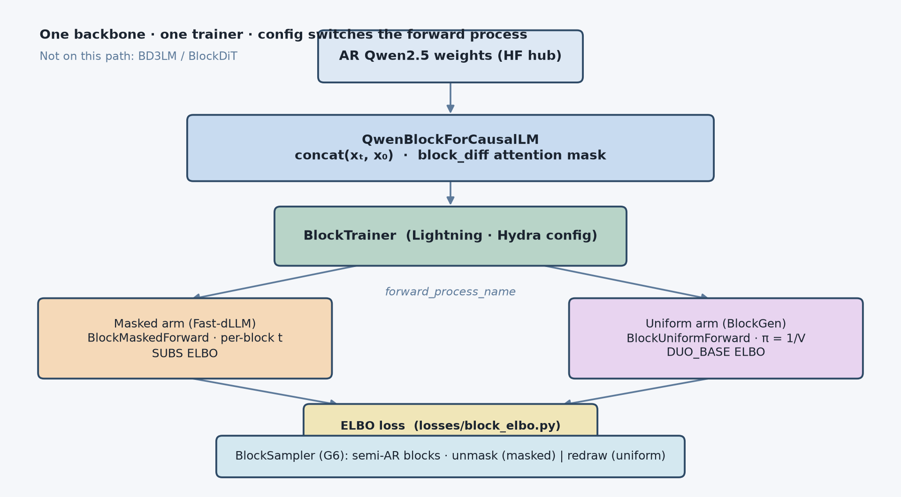

# Qwen block diffusion path

Verified **AR-init block diffusion** on Qwen2: one trainer (`BlockTrainer`), two arms via Hydra (`block_masked` | `block_uniform`). Not BD3LM / BlockDiT.



## Layout (matches UNI-D² conventions)

| Layer | Config | Code |
|-------|--------|------|
| Algorithm | `configs/algo/block_{masked,uniform}.yaml` | `algorithms/block_trainer.py` |
| Model | `configs/model/qwen_block.yaml` | `models/qwen/` |
| Forward process | `configs/forward_process/block_*.yaml` | `forward_process/block_*.py` |
| Loss | — | `losses/block_elbo.py` |
| Sampler | `configs/sampling/block.yaml` | `sampling/block_sampler.py` |
| Noise | `configs/noise/log-linear.yaml` (algo default) | `noise_schedules/log_linear.py` |
| Init metrics | — | `training/init.py` |

## Train (cluster GPU)

```bash
export PYTHONPATH=src

# Masked arm
python -m discrete_diffusion \
  experiment=block_qwen \
  algo=block_masked \
  model.hub_id=Qwen/Qwen2.5-0.5B \
  data.tokenizer_name_or_path=Qwen/Qwen2.5-0.5B

# Uniform arm — only algo changes
python -m discrete_diffusion \
  experiment=block_qwen \
  algo=block_uniform \
  model.hub_id=Qwen/Qwen2.5-0.5B \
  data.tokenizer_name_or_path=Qwen/Qwen2.5-0.5B
```

Or use `bash examples/block_qwen/smoke.sh` / `slurm_verify.sh`.

## Verification

See [VERIFICATION.md](VERIFICATION.md). Tier-0: `pytest tests/ -q -m "not qwen"`. Tier-1+: GPU scripts under `scripts/`.

## References

- [BASELINE.md](BASELINE.md) — what we adopt from Fast-dLLM vs BlockGen
